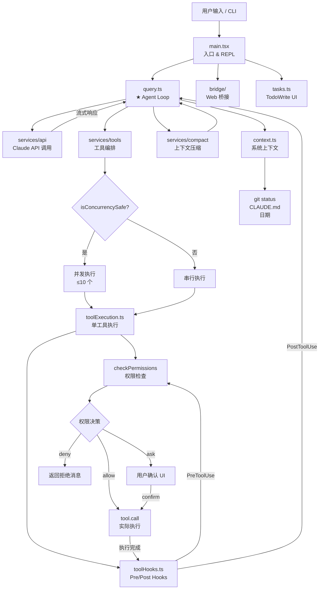

# Claude Code 源码深度分析 — 01 宏观架构

> 基于 claude-code-main 源码（1903 个文件，TypeScript/TSX）深度分析
> 分析日期：2026-04-01

---

## 整体模块划分

```
claude-code-main/src/
├── main.tsx                    # 程序入口（785KB，巨型文件）
├── query.ts                    # ★ Agent 核心循环
├── Tool.ts                     # ★ 工具接口定义
├── context.ts                  # 系统上下文构建
├── history.ts                  # REPL 对话历史持久化
├── tasks.ts / Task.ts          # 任务追踪系统
├── tools.ts                    # 工具注册表
├── commands.ts                 # 斜杠命令注册
│
├── tools/                      # ★ 内置工具实现（60+ 个）
│   ├── BashTool/               # Bash 命令执行（最复杂）
│   ├── FileReadTool/           # 文件读取
│   ├── FileEditTool/           # 文件编辑（精确字符串替换）
│   ├── FileWriteTool/          # 文件写入
│   ├── GrepTool/               # 内容搜索
│   ├── GlobTool/               # 文件匹配
│   ├── AgentTool/              # ★ 子 Agent 执行
│   ├── EnterPlanModeTool/      # 计划模式
│   ├── EnterWorktreeTool/      # Worktree 沙箱
│   └── ...（40+ 个）
│
├── services/                   # 核心服务层
│   ├── api/                    # Claude API 通信
│   ├── compact/                # ★ 上下文压缩（6 种策略）
│   ├── tools/                  # 工具执行编排
│   │   ├── toolOrchestration.ts    # 并发/串行调度
│   │   ├── toolExecution.ts        # 单工具执行
│   │   ├── toolHooks.ts            # Pre/Post hooks
│   │   └── StreamingToolExecutor.ts # 流式并发执行
│   ├── mcp/                    # MCP 协议集成
│   └── analytics/              # 埋点和 A/B 测试（GrowthBook）
│
├── bridge/                     # CLI ↔ claude.ai Web 通信桥
│   ├── bridgeMain.ts           # 桥接入口
│   ├── replBridge.ts           # REPL ↔ Web 桥
│   └── sessionRunner.ts        # 远程会话执行
│
├── commands/                   # 斜杠命令实现（/commit, /review 等）
├── cli/                        # CLI 入口和输出格式化
├── bootstrap/                  # 启动状态（state.ts）
├── hooks/                      # 权限检查钩子
├── state/                      # AppState 管理
├── types/                      # 全局类型定义
└── utils/                      # 工具函数（100+ 文件）
```

---

## 核心模块关系图（Mermaid）



---

## Agent Loop 完整数据流

```
用户输入
    │
    ▼
┌─────────────────────────────────────────────┐
│  queryLoop()  [query.ts:241]                │
│                                             │
│  while(true) {                              │
│    1. 从 compact boundary 截取消息           │
│    2. applyToolResultBudget() — 大结果截断   │
│    3. snipCompact() — 历史片段删除           │
│    4. microCompact() — 微压缩               │
│    5. contextCollapse() — 折叠归档           │
│    6. autoCompact() — 超阈值触发摘要         │
│    7. callModel() — 流式调用 Claude API     │
│       ├── 流式接收 assistant messages       │
│       └── StreamingToolExecutor 并发执行    │
│    8. 若无 tool_use → 检查 stop hooks       │
│       └── 无阻断 → return {reason:'completed'}│
│    9. 若有 tool_use:                        │
│       ├── runTools() — 并发/串行执行        │
│       ├── getAttachmentMessages() — 附件注入│
│       ├── memory prefetch 消费              │
│       └── state = {messages: [..., results]}│
│          → continue (下一轮)               │
│  }                                          │
└─────────────────────────────────────────────┘
    │
    ▼
Terminal: {reason: 'completed' | 'aborted_*' | 'prompt_too_long' | ...}
```

---

## 进程/并发模型

### 主进程结构
```
bun 运行时（单进程）
├── 主线程 — REPL UI（Ink/React）+ Agent Loop
├── Bun Workers（可选）— 后台任务上传
└── 子进程（spawn）— BashTool 命令执行
```

### 工具并发模型
Claude Code 实现了精巧的**分批并发**模型（`toolOrchestration.ts`）：

```
LLM 返回 tool_use 列表: [Grep, Grep, Glob, FileWrite, Grep]

partitionToolCalls() 分批:
  批次1: [Grep, Grep, Glob]  → isConcurrencySafe=true  → 并发执行（最多10个）
  批次2: [FileWrite]         → isConcurrencySafe=false → 串行执行（独占）
  批次3: [Grep]              → isConcurrencySafe=true  → 并发执行

结果保序输出（按原始 tool_use_id 顺序）
```

**判断标准**：`tool.isConcurrencySafe(input)` — 只读工具（Grep、Glob、FileRead）返回 true。

### StreamingToolExecutor（流式并发）
更激进的优化：工具在 **LLM 流式输出期间** 就开始执行，无需等待完整响应：
- 流式接收 `tool_use` block → 立即 `addTool()` 加入执行队列
- 并发 safe 工具立即启动，non-safe 工具排队等待
- 主流继续消费 LLM stream
- `getCompletedResults()` 轮询已完成结果并 yield

---

## 与 Claude API 的通信层

通信层位于 `services/api/`，核心特性：

| 特性 | 实现 |
|------|------|
| 流式传输 | `for await (const message of deps.callModel(...))` — AsyncGenerator |
| 模型切换 | `onStreamingFallback` 回调 + `FallbackTriggeredError` |
| 重试策略 | `withRetry.js` — 自动指数退避 |
| Prompt Cache | `cache_creation_input_tokens` / `cache_read_input_tokens` 追踪 |
| 思维链 | `thinking` / `redacted_thinking` block 保留规则（注释称"wizard's rules"） |
| 工具参数 | `fastMode`, `effortValue`, `advisorModel`, `taskBudget` |
| 降级 | `fallbackModel` 参数，在 `FallbackTriggeredError` 时切换模型重试 |

**关键设计**：thinking block 有严格的"3条规则"（query.ts:152-163注释），必须跨 assistant+tool_result+assistant 的完整 trajectory 保留，否则报 API 错误。

---

## 关键设计决策 #1：AsyncGenerator 贯穿全栈

`query()` 函数返回 `AsyncGenerator`，向上层 yield 每一个流式事件。这个设计决策带来：

- **零阻塞**：UI 可以在 LLM 流式输出时立即更新
- **可取消**：`abortController.signal` 可在任意 yield 点中断
- **可测试**：纯函数式生成器，测试只需 `for await`
- **背压**：消费者决定消费速度

这与传统 callback/Promise 模式的根本区别，是 Claude Code 流畅体验的技术基础。
